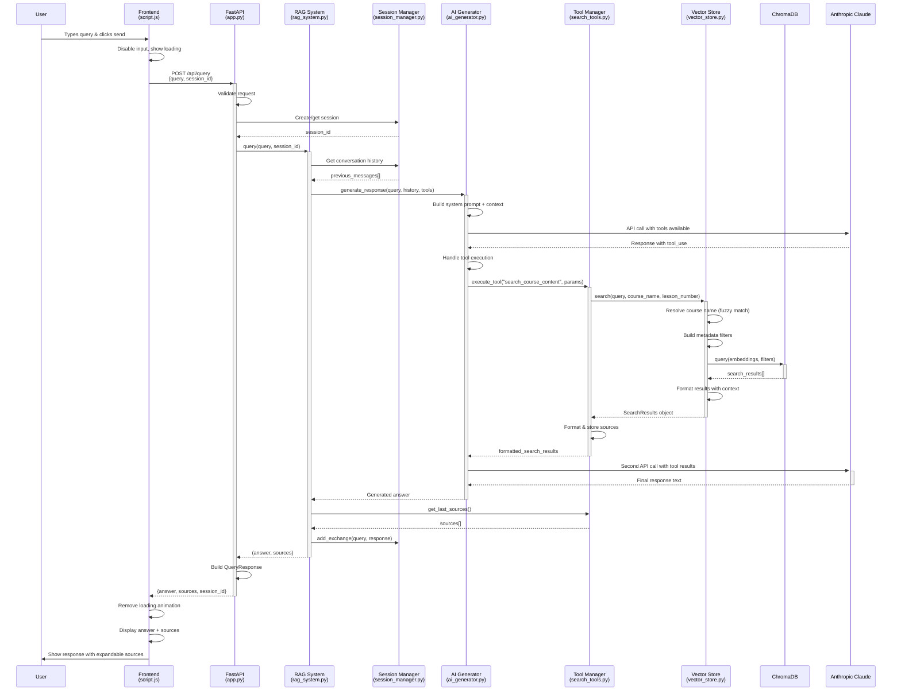

# RAG System Query Processing Flow

## Key Components Explained

### Frontend (script.js)
- Handles user input and UI updates
- Makes API calls and manages loading states
- Displays responses with collapsible source citations

### FastAPI (app.py) 
- REST API endpoint `/api/query`
- Request validation and session management
- Orchestrates RAG system calls

### RAG System (rag_system.py)
- Main coordinator that ties all components together
- Manages conversation context and tool integration
- Handles response assembly and source tracking

### AI Generator (ai_generator.py)
- Interface to Anthropic Claude API
- Handles tool calling workflow
- Manages multi-turn conversations with tools

### Tool Manager & Search Tools (search_tools.py)
- Implements course content search capability
- Provides structured tool definitions for Claude
- Formats search results and tracks sources

### Vector Store (vector_store.py)
- ChromaDB integration for semantic search
- Course name resolution and filtering
- Embedding-based content retrieval

### Session Manager (session_manager.py)
- Maintains conversation history
- Provides context for follow-up questions
- Manages session lifecycle

## Data Flow Summary

1. **Input**: User query → Frontend
2. **Transport**: HTTP POST → FastAPI 
3. **Orchestration**: RAG System coordinates all components
4. **Context**: Session Manager provides conversation history
5. **AI Processing**: Claude decides whether to use search tools
6. **Search**: Vector Store performs semantic search in ChromaDB
7. **Synthesis**: Claude generates final response using search results
8. **Assembly**: RAG System combines response with source citations
9. **Output**: Frontend displays answer with expandable sources

The system uses a tool-calling architecture where Claude autonomously decides when to search for information, enabling intelligent responses that combine general knowledge with specific course content.